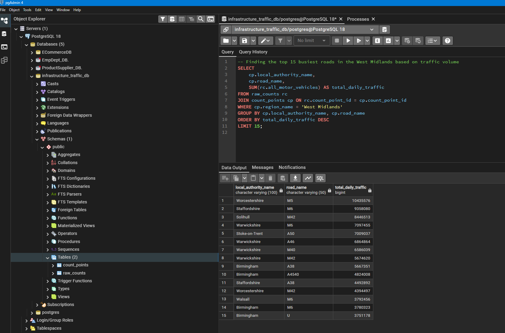

# 🛣️ West Midlands Regional Infrastructure & Traffic Audit (PostgreSQL)


*(Above: Utilising SQL querying to analyse road utilisation across West Midlands local authorities within a 5.1-million-row database.)*

## 🎯 The Objective
As a West Midlands-based BEng Civil Engineer, I wanted to investigate the actual pressure our local road network faces, treating it as a physical supply chain. I built a relational database in PostgreSQL to handle a national dataset from the Department for Transport (DfT) containing **5,113,740 rows** of traffic observations.

**The Goal:** Move beyond standard spreadsheet software limitations to clean, ingest, and query heavy traffic records to identify Heavy Goods Vehicle (HGV) corridors, peak-hour bottlenecks, and active travel trends across regional local authorities.

---

## 💡 What the Data Shows
*Summary of analytical findings extracted from the database:*

### 1. Structural Fatigue (HGV Impact on A-Roads)
In Birmingham, I found that HGVs account for nearly **8% of all traffic** on major Principal A-Roads like the **A47** and **A45**. Because a single heavy lorry causes significantly more physical wear on the road surface than a passenger car, this analysis identifies exactly which routes require prioritised resurfacing and maintenance budgets.


### 2. Network Pressure (Peak Hours)
The regional network hits its absolute limit at **17:00 (5 PM)** and **08:00 (8 AM)**. By isolating these bimodal rush-hour peaks across the counties, logistics firms can implement staggered shifts to reduce fleet idling times and avoid the heaviest congestion.


### 3. Regional Load & Active Travel
*   **Regional Traffic:** Warwickshire, Staffordshire, and Birmingham handle the highest overall traffic volumes, driving regional budget allocations.

*   **Sandwell Cycling Deep-Dive:** I isolated the top routes for pedal cycles in my home borough of Sandwell (such as the A457). This provides data-validated evidence to justify local "Green Infrastructure" and cycle-lane funding.


---

## 🛠️ The Technical Engine (PostgreSQL)
I structured a relational database using a normalized two-table schema to link geographic sensor metadata (`count_points`) to millions of raw traffic observations (`raw_counts`), ensuring sub-second query performance.

### 1. Database Scale & Integrity
The database successfully manages over 5.1 million observations linked to 46,000 sensor locations across the UK.


### 2. Solving ETL Roadblocks (Dirty Data Ingestion)
During the bulk-load phase, the import failed because the raw CSV contained the text string `"NULL"` inside numeric columns. I resolved this ETL roadblock by re-configuring the null-mapping parameters within the pgAdmin Import tool, explicitly instructing the COPY engine to map the string `"NULL"` to a database-level empty value. This preserved data integrity and allowed all 5,113,740 rows to import successfully.


### 3. Intermediate SQL Querying
I developed a suite of queries to demonstrate practical SQL proficiency, using standard joins, groupings, and sorting functions to isolate regional traffic trends.

```sql
-- Finding the top 15 busiest roads in the West Midlands based on traffic volume
SELECT 
    cp.local_authority_name,
    cp.road_name,
    SUM(rc.all_motor_vehicles) AS total_daily_traffic
FROM raw_counts rc
JOIN count_points cp ON rc.count_point_id = cp.count_point_id
WHERE cp.region_name = 'West Midlands'
GROUP BY cp.local_authority_name, cp.road_name
ORDER BY total_daily_traffic DESC
LIMIT 15;
```
## 🏆 Skills Demonstrated
*   **Database Management:** Built a local PostgreSQL database from scratch to handle a dataset of **5.1 Million rows** that was too large for Excel.
*   **SQL Logic:** Used standard SQL (Joins, GROUP BY, and ORDER BY) to filter, aggregate, and rank traffic records
*   **AI Prompting:** Used AI tools to help write SQL syntax faster, troubleshoot error codes, and speed up the coding process.
*   **Data Cleaning (ETL):** Troubleshooted import errors and fixed "dirty" data (like text strings appearing in number columns) so the database would load correctly.
*   **Engineering Context:** Used my Civil Engineering background to relate heavy traffic numbers (HGV volume) to physical road wear-and-tear.

---

### 🎓 Project Credentials
*   **Developer:** Katen Morker
*   **Credentials:** BEng (Hons) Civil Engineering | Certified Data Analyst
*   **Source Data:** UK Department for Transport (DfT) Count Point Datasets
