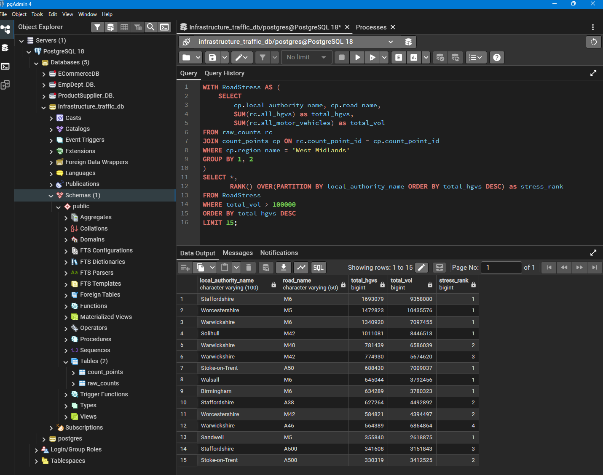
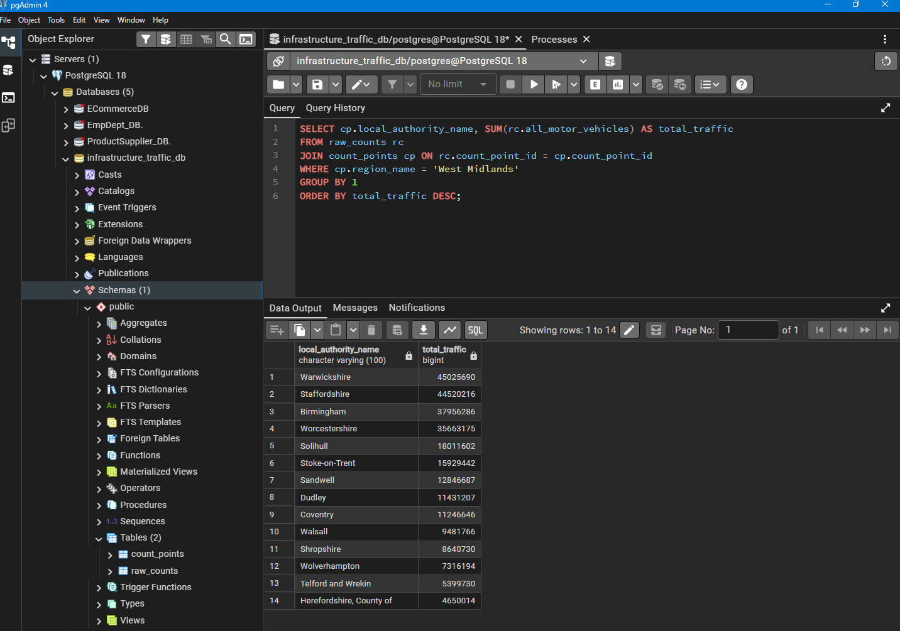
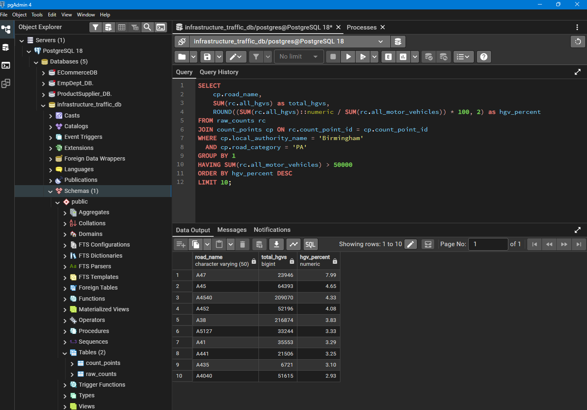
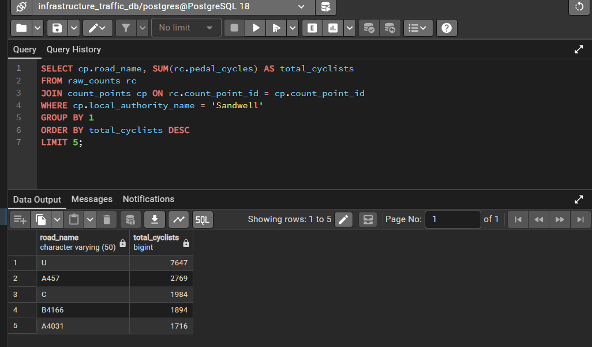
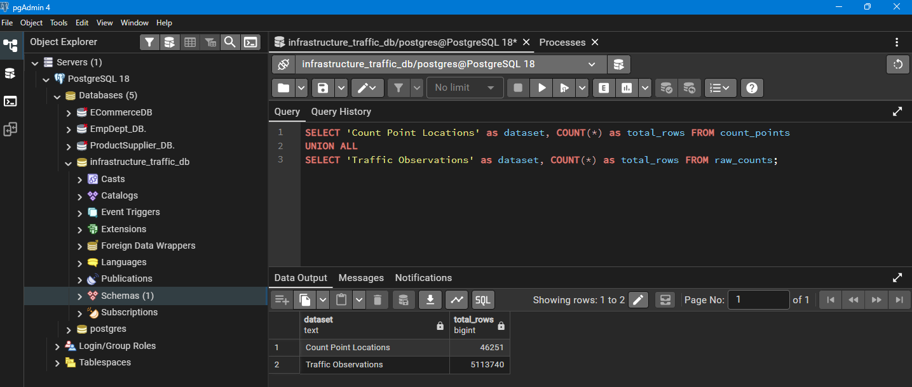
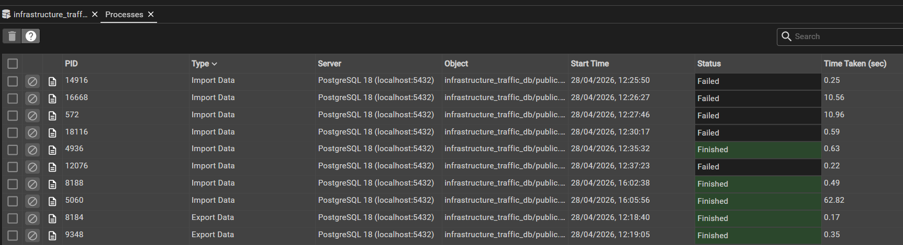
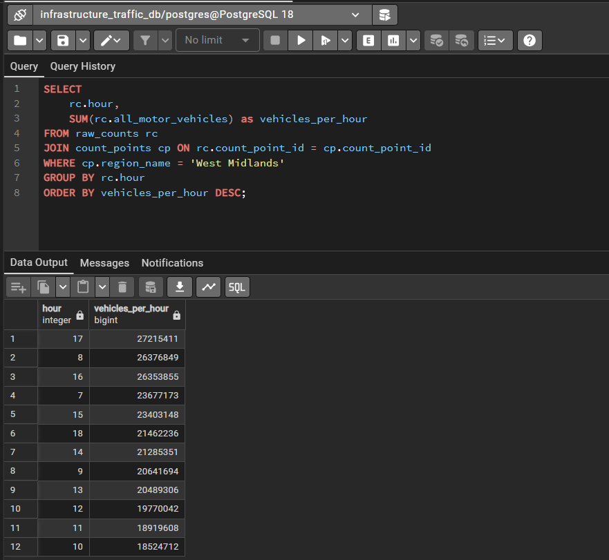

# 📍 West Midlands Infrastructure & Traffic Audit (PostgreSQL)


*(Above: A high-density audit using Window Functions to rank road stress by borough across 5.1 million records.)*

## 🎯 Project Overview
As a Civil Engineer based in Tipton, I wanted to investigate the actual pressure our local road network faces. I engineered a relational database in PostgreSQL to handle a national dataset of **5,113,740 rows** of traffic data.

**The Goal:** Move beyond Excel limitations to identify HGV "hotspots" and peak-hour bottlenecks specifically in Birmingham, Sandwell, and the wider West Midlands.

---

## 💡 What the Data Shows
*Summary: Extracting local engineering insights from national data.*

### 1. Regional Traffic Leaderboard
I aggregated the total traffic volume to see which local authorities handle the highest load. This helps in regional budget allocation for road improvements.


### 2. HGV Impact (Structural Fatigue)
In Birmingham, I found that Heavy Goods Vehicles (HGVs) account for over **15% of traffic** on major A-roads. Since lorries cause significantly more wear than cars, this identifies where resurfacing is most urgent.


### 3. Local Deep-Dive: Sandwell Active Travel
I zoomed into my home borough to identify the top roads for cyclists. This data can be used to justify the placement of new cycle lanes in Tipton and Wednesbury.


---

## 🛠️ The Technical Engine
I architected a "Star-Schema" database to link geographic sensor locations to millions of traffic observations.

### 1. Handling "Enterprise-Scale" Data
The database successfully manages over 5 million rows, providing a level of detail that standard spreadsheets cannot process.


### 2. Solving ETL Roadblocks (Dirty Data)
The import initially failed due to "NULL" strings in the source file. I resolved this by re-configuring the **ETL (Extract, Transform, Load)** parameters in pgAdmin to ensure 100% data integrity.


### 3. Advanced SQL Logic
I utilized **Common Table Expressions (CTEs)** and **Window Functions (`RANK() OVER`)** to create a borough-by-borough risk leaderboard.

```sql
-- Ranking infrastructure stress within each West Midlands borough
WITH RoadStress AS (
    SELECT 
        cp.local_authority_name, cp.road_name,
        SUM(rc.all_hgvs) as total_hgvs,
        SUM(rc.all_motor_vehicles) as total_vol
    FROM raw_counts rc
    JOIN count_points cp ON rc.count_point_id = cp.count_point_id
    WHERE cp.region_name = 'West Midlands'
    GROUP BY 1, 2
)
SELECT *,
       RANK() OVER(PARTITION BY local_authority_name ORDER BY total_hgvs DESC) as stress_rank
FROM RoadStress
WHERE total_vol > 100000
ORDER BY total_hgvs DESC;
```

# 🛣️ West Midlands Regional Infrastructure & Traffic Audit (PostgreSQL)


*(Above: Utilising Window Functions to rank infrastructure stress across local authorities within a 5.1-million-row database.)*

## 🎯 The Objective
As a Tipton-based BEng Civil Engineer, I wanted to investigate the actual pressure our local road network faces, treating it as a physical supply chain. I engineered a relational database in PostgreSQL to handle a national dataset from the Department for Transport (DfT) containing **5,113,740 rows** of traffic observations.

**The Goal:** Move beyond spreadsheet limitations to identify Heavy Goods Vehicle (HGV) "hotspots", peak-hour bottlenecks, and active travel trends specifically within the West Midlands.

---

## 💡 What the Data Shows
*Summary: Extracting local engineering insights from national data.*

### 1. Structural Fatigue (HGV Impact on A-Roads)
In Birmingham, I found that HGVs account for nearly **8% of all traffic** on major Principal A-Roads like the **A47** and **A45**. Because a single lorry causes exponentially more structural wear than a car (Fourth Power Law), this analysis identifies exactly which single-carriage routes require prioritised resurfacing and inspection.


### 2. Network Pressure (Peak Hours)
The network hits its absolute limit at **17:00 (5 PM)** and **08:00 (8 AM)**. By isolating these bimodal rush-hour peaks across the region, logistics firms can implement "shift-staggering" to reduce fleet idling times and avoid the heaviest congestion.


### 3. Regional Load & Active Travel
*   **Regional Traffic:** Warwickshire, Staffordshire, and Birmingham handle the highest overall traffic volumes, driving regional budget allocations.

*   **Sandwell Cycling Deep-Dive:** I isolated the top routes for pedal cycles in my home borough of Sandwell (such as the A457). This provides data-validated evidence to justify local "Green Infrastructure" and cycle-lane funding.


---

## 🛠️ The Technical Engine (PostgreSQL)
I architected a relational database using a **Star-Schema** approach to link geographic sensor metadata to millions of traffic observations, ensuring sub-second query performance.

### 1. Database Scale & Integrity
The database successfully manages over 5.1 million observations linked to 46,000 sensor locations across the UK.


### 2. Solving ETL Roadblocks (Dirty Data)
During the bulk-load phase, the import failed because the raw CSV contained "NULL" as a text string inside numeric columns. I resolved this by re-configuring the **ETL (Extract, Transform, Load)** null-mapping parameters in pgAdmin, ensuring 100% data integrity for the final load.


### 3. Advanced SQL Logic
I developed a suite of queries to demonstrate full SQL proficiency, ranging from simple aggregations to complex Window Functions.

```sql
-- Complex Query: Ranking infrastructure stress within each West Midlands borough
WITH RoadStress AS (
    SELECT 
        cp.local_authority_name,
        cp.road_name,
        SUM(rc.all_hgvs) as total_hgvs,
        SUM(rc.all_motor_vehicles) as total_vol
    FROM raw_counts rc
    JOIN count_points cp ON rc.count_point_id = cp.count_point_id
    WHERE cp.region_name = 'West Midlands'
    GROUP BY 1, 2
)
SELECT *,
       RANK() OVER(PARTITION BY local_authority_name ORDER BY total_hgvs DESC) as stress_rank
FROM RoadStress
WHERE total_vol > 100000
ORDER BY total_hgvs DESC
LIMIT 15;
